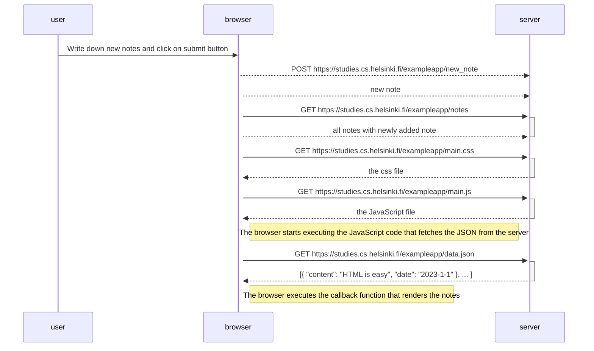
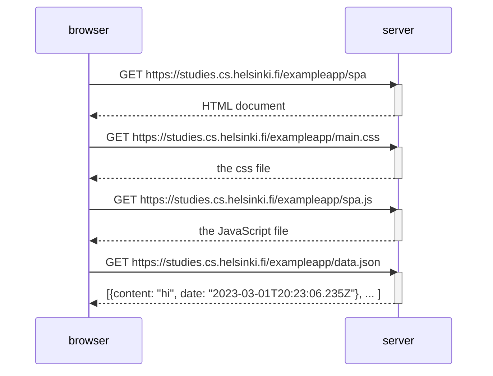
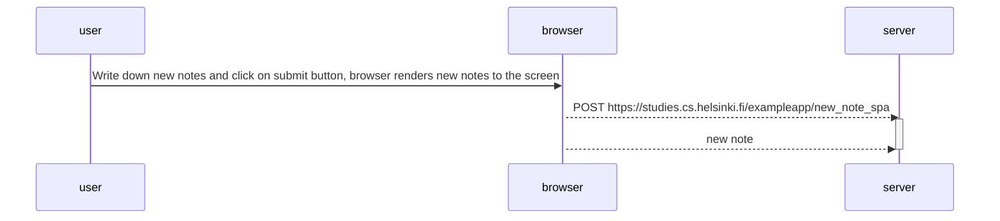

# Fullstack-Open-Practice
## Part 0
### 0.4 Diagram for new note 

```mermaid
sequenceDiagram
    participant user
    participant browser
    participant server
    
    user->>browser: Write down new notes and click on submit button
    activate browser
    browser-->>server: POST https://studies.cs.helsinki.fi/exampleapp/new_note
    activate browser
    browser-->>server: new note
    activate server
  
    
    browser->>server: GET https://studies.cs.helsinki.fi/exampleapp/notes
    activate server
    browser-->>server: all notes with newly added note
    deactivate server

    browser->>server: GET https://studies.cs.helsinki.fi/exampleapp/main.css
    activate server
    server-->>browser: the css file
    deactivate server
    
    browser->>server: GET https://studies.cs.helsinki.fi/exampleapp/main.js
    activate server
    server-->>browser: the JavaScript file
    deactivate server
    
    Note right of browser: The browser starts executing the JavaScript code that fetches the JSON from the server
    
    browser->>server: GET https://studies.cs.helsinki.fi/exampleapp/data.json
    activate server
    server-->>browser: [{ "content": "HTML is easy", "date": "2023-1-1" }, ... ]
    deactivate server

    Note right of browser: The browser executes the callback function that renders the notes
```
### 0.5 Diagram for single page app

```mermaid
sequenceDiagram
    participant browser
    participant server
    
    browser->>server: GET https://studies.cs.helsinki.fi/exampleapp/spa
    activate server
    server-->>browser: HTML document
    deactivate server
    
    browser->>server: GET https://studies.cs.helsinki.fi/exampleapp/main.css
    activate server
    server-->>browser: the css file
    deactivate server
    
    browser->>server: GET https://studies.cs.helsinki.fi/exampleapp/spa.js
    activate server
    server-->>browser: the JavaScript file
    deactivate server
    
    browser->>server: GET https://studies.cs.helsinki.fi/exampleapp/data.json
    activate server
    server-->>browser: [{content: "hi", date: "2023-03-01T20:23:06.235Z"}, ... ]
    deactivate server
 
```
### 0.6 Diagram for new note in single page application

```mermaid
sequenceDiagram
    participant user
    participant browser
    participant server

    user->>browser: Write down new notes and click on submit button, browser renders new notes to the screen
    activate browser
    browser-->>server: POST https://studies.cs.helsinki.fi/exampleapp/new_note_spa
    activate server
    browser-->>server: new note
    deactivate server    
```