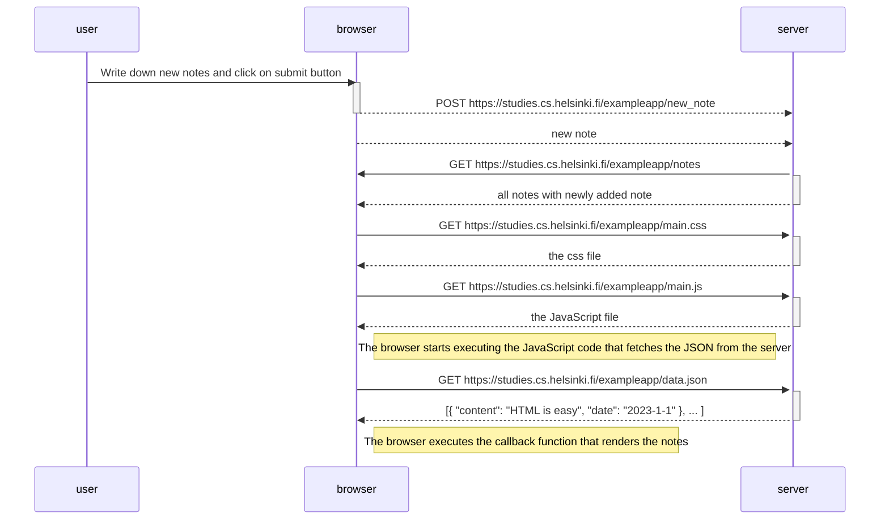

# Fullstack-Open-Practice
## Part 0
### Diagram for new note 

```mermaid
sequenceDiagram
    participant user
    participant browser
    participant server
    
    user->>browser: Write down new notes and click on submit button
    activate browser
    browser-->>server: POST https://studies.cs.helsinki.fi/exampleapp/new_note
    deactivate browser
    browser-->>server: new note
    activate server
  
    
    server->>browser: GET https://studies.cs.helsinki.fi/exampleapp/notes
    activate server
    server-->>browser: all notes with newly added note
    deactivate server

    browser->>server: GET https://studies.cs.helsinki.fi/exampleapp/main.css
    activate server
    server-->>browser: the css file
    deactivate server
    
    browser->>server: GET https://studies.cs.helsinki.fi/exampleapp/main.js
    activate server
    server-->>browser: the JavaScript file
    deactivate server
    
    Note right of browser: The browser starts executing the JavaScript code that fetches the JSON from the server
    
    browser->>server: GET https://studies.cs.helsinki.fi/exampleapp/data.json
    activate server
    server-->>browser: [{ "content": "HTML is easy", "date": "2023-1-1" }, ... ]
    deactivate server

    Note right of browser: The browser executes the callback function that renders the notes
```
### Diagram for single page app
### Diagram for new note in single page application
